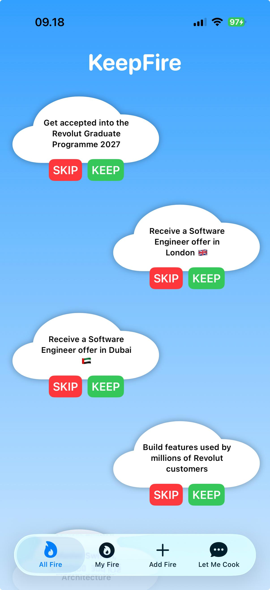
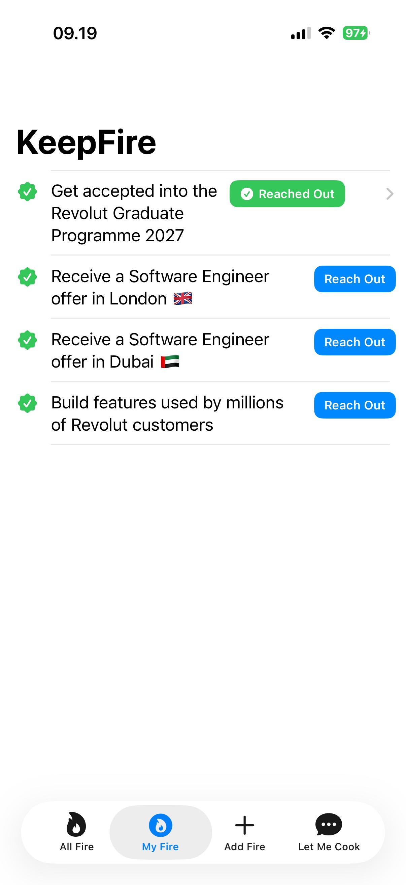
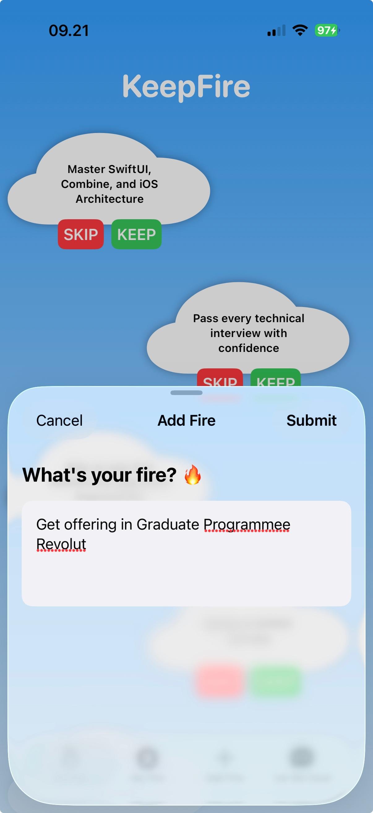
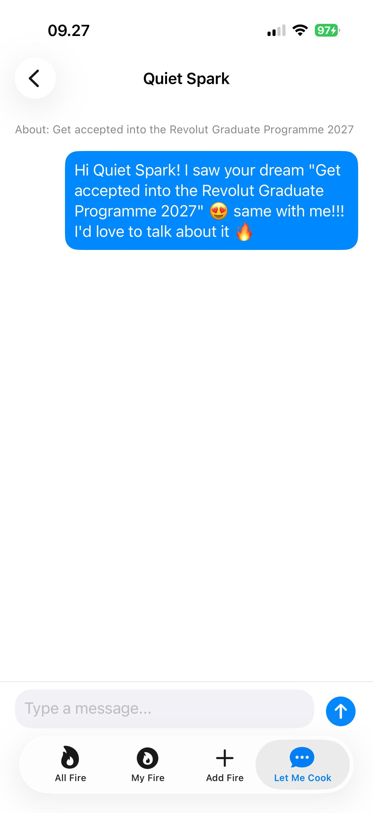
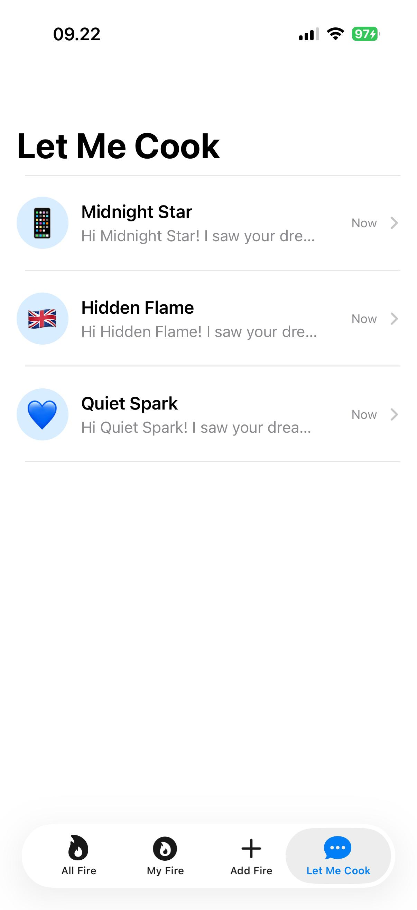

# KeepFire 🔥

KeepFire is a space to realize that you are never alone in pursuing your ambitions.
Whether it's a dream, a goal, or a life plan. This app connects your inner spirit
with the world by letting you share your dream, discover other people's dreams,
and reach out to the people chasing similar ones.

## Features

- **All Fire** — swipe through dreams shared by others, skip or keep the ones that resonate with you
- **My Fire** — see the dreams you've kept, and reach out to the people behind them
- **Add Fire** — share your own dream with the community
- **Let Me Cook** — chat with people you've reached out to about their dream

## Screenshots

<p align="center">
  
  
  
  
  
</p>

| All Fire | My Fire | Add Fire | Let Me Cook |
|---|---|---|---|
| Browse & discover dreams | Your saved dreams | Share your own dream | Chat with people |

## Tech stack

- **Swift** & **SwiftUI** — UI and app logic
- **MVVM architecture** — clean separation between View, ViewModel, and data layer
- **Core Data** + **Combine** — local persistence and reactive updates for dreams
- **Realm** + **RxSwift** — local persistence and reactive updates for chats
- **XCTest** — unit tests for ViewModels and repositories, written TDD-style

## Project structure

```
KeepFireV.2/
├── Models/            → plain data models (Dream, Chat, ChatMessage)
├── Repositories/       → protocols that define what each repository must do
├── Persistence/
│   ├── CoreData/       → Dream storage (Core Data + Combine)
│   └── Realm/          → Chat storage (Realm + RxSwift)
├── ViewModels/         → app logic, bridges data to the UI
├── Views/              → SwiftUI screens
└── DependencyContainer.swift → wires repositories to ViewModels

KeepFireV.2Tests/
├── Mocks/              → fake repositories used in tests
├── ViewModelTests.swift
└── RepositoryTests.swift
```

## Getting started

1. Clone this repo and open `KeepFireV.2.xcodeproj` in Xcode.
2. Make sure the Swift Package dependencies (RealmSwift, RxSwift, RxRelay) are resolved, Xcode should do this automatically on first open. If not: *File → Packages → Resolve Package Versions*.
3. Build & run on a simulator or device (⌘R).
4. Run the test suite with ⌘U.

## Author

Made by [Nadila Rizky Amelia](https://github.com/nadilarizky05) (Learner at Apple Developer Academy Bali, Programming Teacher at Timedoor Academy.)
